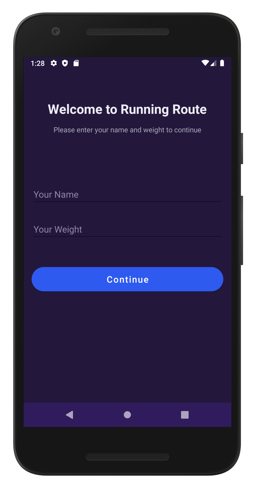
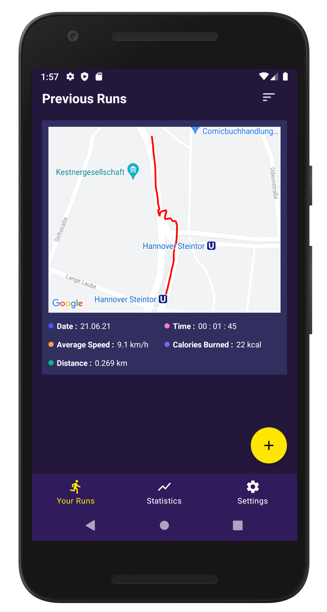
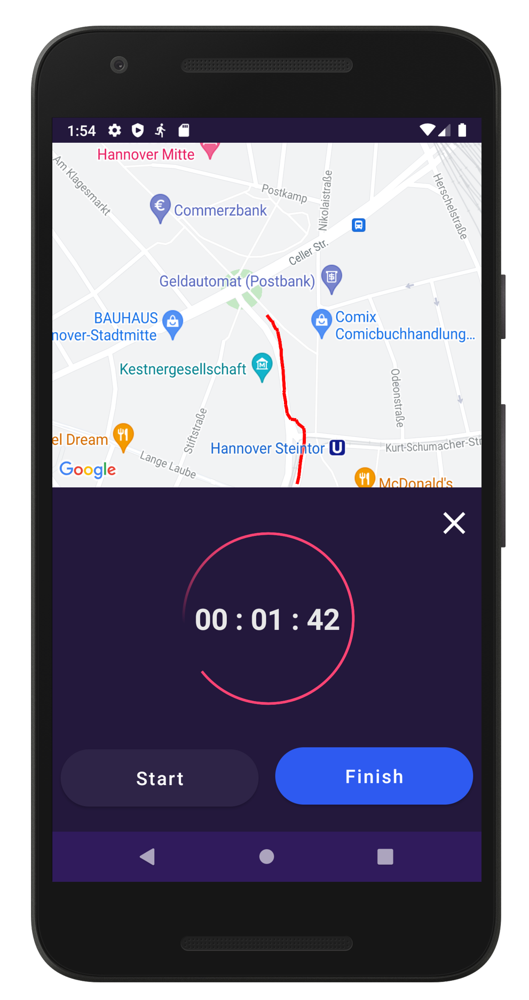
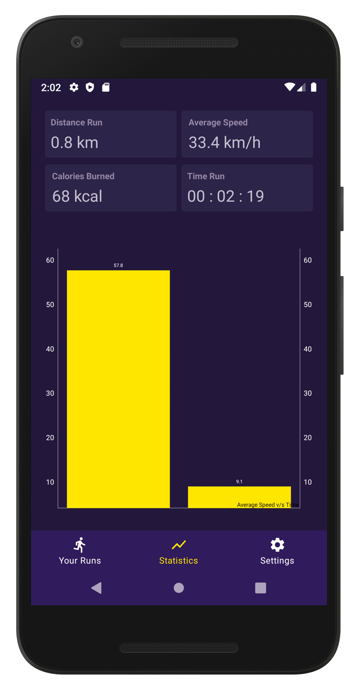
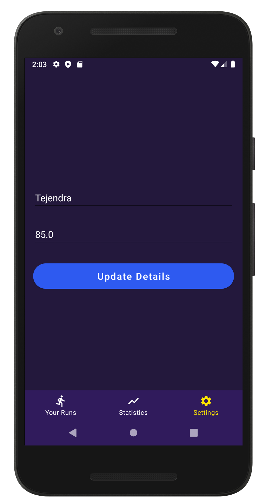

# Running Route

Running Route is an android app to easily track and analyse your runs. The application implements a clean MVVM (Model View ViewModel) architecture and uses Dagger Hilt for dependency injection.

Once a run is initiated, it can be visually tracked on the map with a timer representing the elapsed time. An active run can also be tracked by the notification in the notification area. All the finished runs are stored locally in a room database. Home Screen displays a list of user's previous runs along with some useful metrics like distance run, calories burned, average speed, date and run duration. Statistics Screen displays the overall metrics for all the runs that the user has finished.

## Steps to Run

1. Download or clone the repository.
2. Get a Google Maps API key from [here](https://developers.google.com/maps/documentation/android-sdk/get-api-key).
3. Open `strings.xml` file and replace `API_KEY_HERE` with your API key.
4. Run the app on an emulator or physical device.

## Screenshots

  
   
  
  
  

## License

This project is currently licensed under the Apache License Version 2.0. A copy of [LICENSE](LICENSE) should be present along with the source code.
